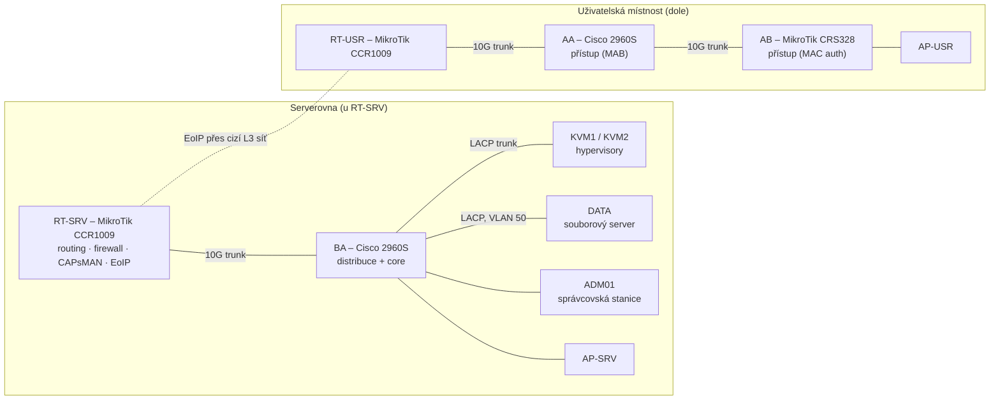

# Homelab – segmentovaná podniková síť

Kompletně segmentovaná podniková síť, kterou jsem navrhl a postavil od nuly jako samostatný projekt nad rámec výuky.
Většinu použitých technologií jsem se naučil samostudiem. Byla to moje vlastní infrastruktura, **co nejméně závislá na
cizí síti**: z uplinku jsem využíval jen internetovou konektivitu, vše ostatní – datový server, adresářové služby,
DHCP, RADIUS – běželo na vlastních serverech. Síť využívala skupina zhruba pěti lidí (já a čtyři kolegové
brigádníci), takže v ní byl skutečný provoz. Při návrhu mi radil zkušenější konzultant, který se do sítě občas podíval.

Síť už fyzicky neexistuje (po skončení projektu jsem ji rozebral). Repozitář dokumentuje návrh a obsahuje **vyčištěné
konfigurace** (bez hesel, klíčů a skutečných MAC adres) ze zachované zálohy ze stavu k **červnu 2026**. Názvy domén,
SSID a hostitelů jsou zobecněné.

## Stav

**Realizováno:** segmentace a firewall, RADIUS/MAB, DHCP failover, DNS, NTP, Samba AD, souborový server, VPN, Wi‑Fi
(CAPsMAN), EoIP, virtualizace. Interní certifikační autorita vznikla v první fázi projektu a později se dál neudržovala.
**Pouze návrh (nedokončeno):** monitoring (VLAN 14), automatizace přes Ansible (VLAN 15) a zálohování přes Bacula (VLAN 98).

## Ve zkratce

| | |
|---|---|
| Segmentace | **23 VLAN**, schéma `172.22.<VLAN>.0/24`, brána `.254` (kromě routerové VLAN 12) |
| Směrování a firewall | MikroTik CCR1009 (RouterOS 7), výchozí politika `drop`, výjimky jen pro potřebné toky |
| Přepínání | 2× Cisco Catalyst 2960S (přístup + distribuce/core), MikroTik CRS328 |
| Wi‑Fi | MikroTik **CAPsMAN**, přístupové body cAP ac, ověřování MAC přes RADIUS |
| Řízení přístupu | **FreeRADIUS** (2 instance), MAB s dynamickým přiřazením VLAN |
| Fyzické servery | `KVM1` (služby), `KVM2` (herní VM), `DATA` (souborový server) |
| Virtualizace | KVM/QEMU + libvirt + Cockpit na AlmaLinux 9.7; `KVM1` hostoval **15 VM**; LACP bond s VLAN bridge |
| Základní služby | ISC DHCP (**failover**), BIND DNS ×2 (master/secondary), Chrony NTP ×2 |
| Adresářové služby | 2× Samba AD DC (`samba-tool domain provision`), souborový server (člen domény) |
| Vzdálený přístup | Tailscale (osobní účet), OpenVPN (hotový skript `openvpn-install`, jen pro konzultanta) |
| Rozšíření LAN | **EoIP** tunel mezi serverovnou a uživatelskou místností přes cizí L3 síť |

## Architektura

> Diagram je logický pohled sestavený z konfigurací (uplinky `UPLINK-*`, trunky, EoIP). Umístění AP-USR/AP-SRV se
> odvozuje z názvů a portů.

## Obsah

- [`docs/01-vlan-plan.md`](docs/01-vlan-plan.md) – plán VLAN a adresace
- [`docs/02-hosts.md`](docs/02-hosts.md) – zařízení a služby podle VLAN
- [`docs/03-network-design.md`](docs/03-network-design.md) – L2/L3 návrh, firewall, EoIP, Wi‑Fi
- [`docs/04-authentication.md`](docs/04-authentication.md) – řízení přístupu (RADIUS, MAB)
- [`docs/05-services.md`](docs/05-services.md) – DHCP, DNS, NTP, Samba AD, virtualizace, seznam VM
- [`docs/06-notes-and-next-steps.md`](docs/06-notes-and-next-steps.md) – známé nedostatky a další vývoj
- [`configs/`](configs/) – vyčištěné konfigurace (viz níže)
- [`apps/e-ink-tables`](apps/e-ink-tables) – skript pro aktualizaci e‑ink tabulek

## Konfigurace a bezpečnost

Konfigurace jsou **vyčištěné** před zveřejněním: hesla, hashe, sdílené klíče a UUID jsou odstraněny, MAC adresy
nahrazeny dokumentačním rozsahem `00:00:5e:00:53:xx`, jména zařízení a majitelů anonymizována a adresy sítí mimo
tento projekt nahrazeny dokumentačními rozsahy (`192.0.2.0/24`, `198.51.100.0/24`); jako upstream DNS používají BIND servery Cloudflare (`1.1.1.1`, `1.0.0.1`). Soubory s příponou `.example`
jsou vzory struktury.

## Použití AI

Při přípravě dokumentace jsem používal nástroje umělé inteligence k formulaci a formátování textu. Návrh sítě,
konfigurace a technická rozhodnutí jsou moje a za obsah odpovídám.
